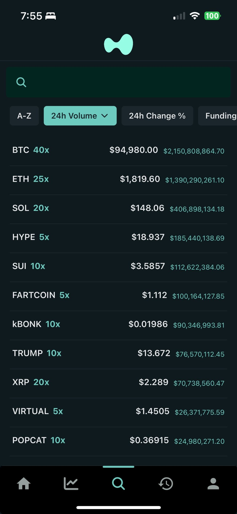

# Hyperliquid Mobile Companion

A React Native mobile application for trading on the Hyperliquid decentralized exchange. This app provides a comprehensive mobile interface for managing positions, placing orders, and monitoring your trading portfolio.

## Prerequisites

Before you begin, ensure you have the following installed:

- **Node.js** (v18 or higher)
- **npm** or **yarn**
- **Expo CLI** (`npm install -g @expo/cli`)
- **EAS CLI** (`npm install -g eas-cli`)

## Getting Started

### 1. Clone the Repository

```bash
git clone github.com/cezar-r/hyperliquid-mobile-companion
cd hyperliquid-mobile-companion
```

### 2. Install Dependencies

```bash
npm install
# or
yarn install
```

### 3. Environment Setup

Create a `.env` file in the root directory and add the required environment variables:

```bash
# Hyperliquid Lambda API URL
HYPERLIQUID_LAMBDA_URL=https://<your-hl-processing-lambda>.lambda-url.us-east-2.on.aws/
```


### 4. Development

Start the development server:

```bash
npm start
# or
yarn start
```

This will open the Expo development tools where you can:
- Run on iOS simulator
- Run on Android emulator
- Run on physical device using Expo Go app

## Building and Publishing

### Prerequisites for Publishing

1. **Expo Account**: Sign up at [expo.dev](https://expo.dev)
2. **Apple Developer Account**: Required for iOS App Store submission
3. **EAS Project Setup**: The project is already configured with EAS

### Build and Publish Steps

1. **Login to Expo** (if not already logged in):
   ```bash
   eas login
   ```

2. **Configure EAS Build** (if not already configured):
   ```bash
   eas build:configure
   ```

3. **Build and Submit to App Store**:
   ```bash
   ./build_and_publish.sh
   ```

   This script will:
   - Configure EAS build settings
   - Build the iOS app
   - Submit to the App Store

### Manual Build Commands

If you prefer to run commands individually:

```bash
# Build for iOS
eas build --platform ios

# Submit to App Store
eas submit --platform ios

# Build for Android (if needed)
eas build --platform android
```

### Build Profiles

The project includes three build profiles:
- **development**: For development testing
- **preview**: For internal testing
- **production**: For App Store submission

## App Screenshots

### 1. Sign In Screen


The onboarding screen where users connect their wallet to access the Hyperliquid trading platform. Features a clean, modern interface with wallet connection options and the Hyperliquid branding.

### 2. Home Screen


The main dashboard showing your portfolio overview, current positions, and account balance. Displays real-time P&L, open positions, and quick access to trading functions.

### 3. Place Order Screen


The trading interface where users can place market and limit orders. Includes advanced features like leverage adjustment, margin type selection, and take-profit/stop-loss order placement.

### 4. P&L Screen


Detailed profit and loss tracking view showing position performance, unrealized gains/losses, and trading history with comprehensive analytics.

### 5. Search Screen


Market discovery interface allowing users to search for trading pairs, view market data, and access recent searches with sorting and filtering options.


## Configuration

### App Configuration (`app.json`)
- **App Name**: Hyperliquid
- **Bundle ID**: com.cezarrr.HyperliquidMobileCompanion
- **Version**: 1.1.1
- **Build Number**: 9

### EAS Configuration (`eas.json`)
- Configured for iOS production builds
- Auto-increment build numbers
- Development and preview profiles available

## Troubleshooting


For issues related to:
- **Hyperliquid API**: Check the [Hyperliquid documentation](https://hyperliquid.gitbook.io/hyperliquid/)
- **Expo/EAS**: Visit [Expo documentation](https://docs.expo.dev/)
- **React Native**: Check [React Native documentation](https://reactnative.dev/)

## License

This project is licensed under the MIT License - see the [LICENSE](LICENSE.md) file for details.

## Contributing

Contributions are welcome! Please feel free to submit a Pull Request. For major changes, please open an issue first to discuss what you would like to change.

Please make sure to update tests as appropriate. 